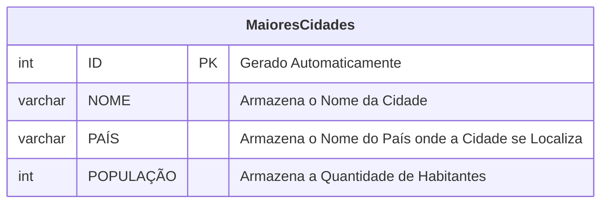
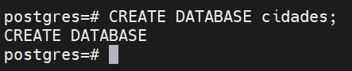
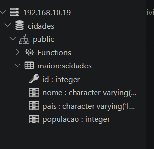
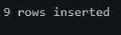
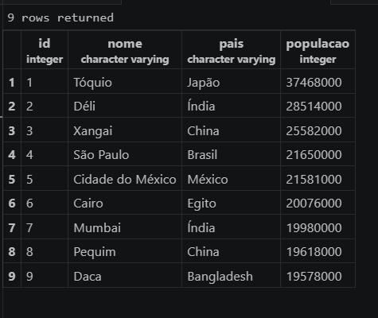
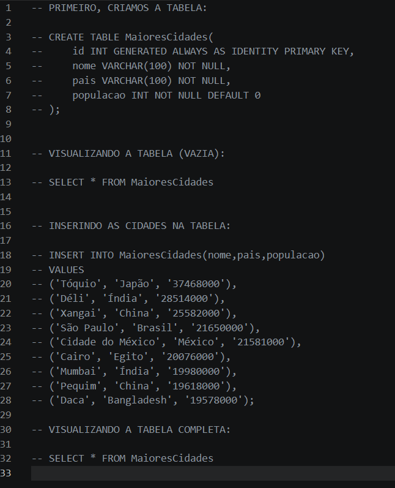

# 🎲 **Criando o Primeiro Banco de Dados:**

Vamos criar um Banco de Dados com as 10 cidades mais populosas do mundo.



---

### **Criando a Database:**

Primeiro, no MobaXterm, criaremos nossa Database:



---

### **Criando a Tabela:**

Depois, com nossa Database já conectada ao PostgreSQL Explorer, vamos criar a tabela com o código:

```postgresql
CREATE TABLE MaioresCidades(
    id INT GENERATED ALWAYS AS IDENTITY PRIMARY KEY,
    nome VARCHAR(100) NOT NULL,
    pais VARCHAR(100) NOT NULL,
    populacao INT NOT NULL DEFAULT 0
);
```

Já conseguimos ver o resultado através do PostgreSQL Explorer:


---

### **Visualizando a Tabela:**

Vamos ver como ficou a tabela usando `SELECT * FROM MaioresCidades;`


---

### **Adicionando as Cidades:**

Antes, pesquisamos quais as 10 cidades mais populosas do mundo e organizamos os dados. Usamos a [Wikipédia](https://pt.wikipedia.org/wiki/Lista_das_cidades_mais_populosas_do_mundo) como fonte. Ficamos com o seguinte resultado:

---

| Nome | País | População |
| --- | --- | --- |
| Tóquio | Japão | 37468000 |
| Déli | Índia | 28514000 |
| Xangai | China | 25582000 |
| São Paulo | Brasil | 21650000 |
| Cidade do México | México | 21581000 |
| Cairo | Egito | 20076000 |
| Mumbai | Índia | 19980000 |
| Pequim | China | 19618000 |
| Daca | Bangladesh | 19578000 |

> Os dados foram retirados de uma estimativa da ONU de 2018 e estão desatualizados. O uso desses dados é "estético".

---

Agora vamos criar a tabela com o seguinte código: 

```postgresql
INSERT INTO MaioresCidades(nome,pais,populacao)
VALUES
('Tóquio', 'Japão', '37468000'),
('Déli', 'Índia', '28514000'),
('Xangai', 'China', '25582000'),
('São Paulo', 'Brasil', '21650000'),
('Cidade do México', 'México', '21581000'),
('Cairo', 'Egito', '20076000'),
('Mumbai', 'Índia', '19980000'),
('Pequim', 'China', '19618000'),
('Daca', 'Bangladesh', '19578000');
```

---

### **Os Resultados:**

**Resultado:**




**Visualizando a tabela:**




**Ao fim, nosso arquivo query ficou assim:**


> OBS: As linhas foram comentadas logo após sua execução para evitar que os comandos fossem executados mais de uma vez