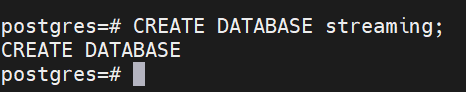
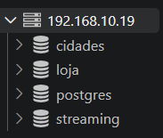
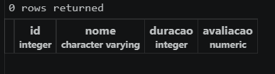
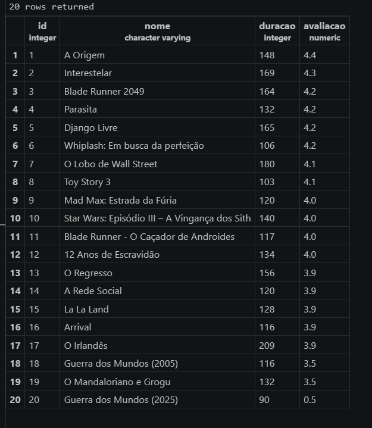
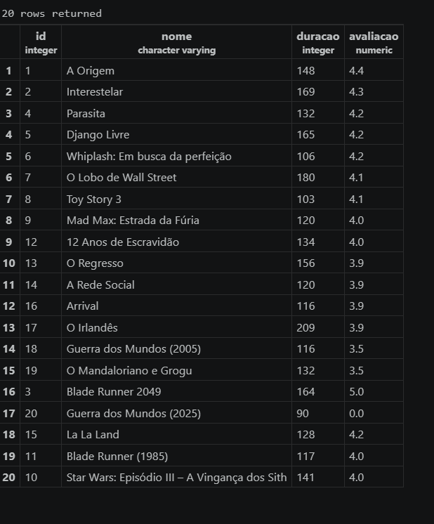
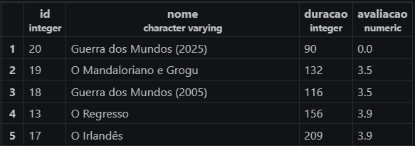
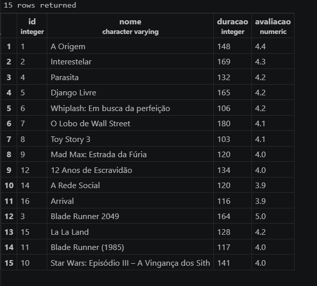

# 📝 Atividade prática - Criação de Streaming

## 🐧 Criando a Database

Para criarmos um banco de dados de filmes para o nosso streaming, usaremos o nosso servidor Linux. Para acessarmos o postgres, usamos o comando
`sudo -u postgres psql` 

Então, criamos a database com o comando `CREATE DATABASE streaming;`



Dentro do VSCode, já conseguimos ver nossa Database criada:



---

## 🎥 A Lista de Filmes

Antes de partirmos para qualquer linha de código, precisamos estruturar como nossa database deve se parecer. Para isso, escolhemos 20 filmes e reunimos as informações sobre eles que precisamos (Sua duração em minutos e sua avaliação em uma nota de 0 a 5 estrelas) nessa tabela:

| Nome do Filme | Duração (Minutos) | Avaliação (0-5)
| :--- | :--- | :--- |
| A Origem | 148 | 4.4 |
| Interestelar | 169 | 4.3 |
| Blade Runner 2049 | 164 | 4.2 |
| Parasita | 132 | 4.2 |
| Django Livre | 165 | 4.2 |
| Whiplash: Em busca da perfeição | 106 | 4.2 |
| O Lobo de Wall Street | 180 | 4.1 |
| Toy Story 3 | 103 | 4.1 |
| Mad Max: Estrada da Fúria | 120 | 4 |
| Star Wars: Episódio III – A Vingança dos Sith | 140 | 4 |
| Blade Runner - O Caçador de Androides | 117 | 4 |
| 12 Anos de Escravidão | 134 | 4 |
| O Regresso | 156 | 3.9 |
| A Rede Social | 120 | 3.9 |
| La La Land | 128 | 3.9 |
| Arrival | 116 | 3.9 |
| O Irlandês | 209 | 3.9 |
| Guerra dos Mundos (2005) | 116 | 3.5 |
| O Mandaloriano e Grogu | 132 | 3.5 |
| Guerra dos Mundos (2025) | 90 | 0.5 |

---

## 📑 A Tabela:

Dentro da Database, criamos um novo query. Nesse arquivo de query vamos começar nossos comandos. Primeiro, vamos criar a tabela da nossa database com o seguinte comando:

```sql
CREATE TABLE filmes(
    id INT GENERATED ALWAYS AS IDENTITY PRIMARY KEY,
    nome VARCHAR(100) NOT NULL,
    duracao INT NOT NULL DEFAULT 0,
    avaliacao NUMERIC(2, 1) NOT NULL DEFAULT 0
);
```

Após o comando, a tabela já foi criada, mas por enquanto está vazia:




## 🎬 Adicionando os Filmes:

Vamos usar esse comando para adicionarmos de uma vez todos os 20 filmes que catalogamos naquela tabela interior:

```sql
INSERT INTO filmes(nome, duracao, avaliacao) VALUES 
('A Origem', 148, 4.4),
('Interestelar', 169, 4.3),
('Blade Runner 2049', 164, 4.2),
('Parasita', 132, 4.2),
('Django Livre', 165, 4.2),
('Whiplash: Em busca da perfeição', 106, 4.2),
('O Lobo de Wall Street', 180, 4.1),
('Toy Story 3', 103, 4.1),
('Mad Max: Estrada da Fúria', 120, 4.0),
('Star Wars: Episódio III – A Vingança dos Sith', 140, 4.0),
('Blade Runner - O Caçador de Androides', 117, 4.0),
('12 Anos de Escravidão', 134, 4.0),
('O Regresso', 156, 3.9),
('A Rede Social', 120, 3.9),
('La La Land', 128, 3.9),
('Arrival', 116, 3.9),
('O Irlandês', 209, 3.9),
('Guerra dos Mundos (2005)', 116, 3.5),
('O Mandaloriano e Grogu', 132, 3.5),
('Guerra dos Mundos (2025)', 90, 0.5);
```

Após o uso desse comando, a tabela já está completa com os 20 filmes:



## 🔄️ Atualizando os Dados

Vamos agora alterar **5** dados:

> **Blade Runner 2049:** Avaliação 4.2 -> 5.0
> 
> **Guerra dos Mundos (2025):** Avaliação 0.5 -> 0.0
> 
> **La La Land:** Avaliação 3.9 -> 4.2
> 
> **Blade Runner - O Caçador de Androides:** Nome -> Blade Runner (1985)
> 
> **Star Wars: Episódio III - A Vingança dos Sith:** Duração 140 -> 141

Para modificar esses dados, vamos usar esse conjunto de comandos:

```sql
UPDATE filmes
SET avaliacao = 5.0
WHERE id = 3;

UPDATE filmes
SET avaliacao = 0.0
WHERE id = 20;

UPDATE filmes
SET avaliacao = 4.2
WHERE id = 15;

UPDATE filmes
SET nome = 'Blade Runner (1985)'
where id = 11;

UPDATE filmes
SET duracao = 141
WHERE id = 10;
```

Após isso nossa tabela ficou assim, com esses 5 dados modificados:



## 🗑️ Deletado Dados

Temos que deletar **5** registros (filmes). Vamos escolher deletar os 5 filmes com pior avaliação. Para visualizarmos os 5 filmes pior avaliados usamos esse seguinte comando e selecionamos os primeiros 5 filmes que aparecerem:

```sql
SELECT * FROM filmes ORDER BY avaliacao;
```

Vemos que os 5 primeiros filmes que apareceram são os 5 pior avaliados:



Então vamos deletar esses 5 filmes. Para isso, usamos esse conjunto de comandos:

```sql
DELETE FROM filmes WHERE id = 20;
DELETE FROM filmes WHERE id = 19;
DELETE FROM filmes WHERE id = 18;
DELETE FROM filmes WHERE id = 13;
DELETE FROM filmes WHERE id = 17;
```

Pronto, nossa tabela final ficou assim:

