# 📝 Atividade prática - Análise de Dados (Livraria)

## 💻 Preparativos:

Primeiro, criamos a database no MobaXterm com o comando `CREATE DATABASE livros;`

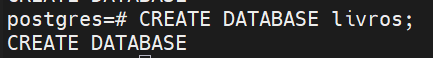


Depois, criamos a tabela com o código:

```sql
CREATE TABLE livros(
    id SERIAL PRIMARY KEY,
    titulo VARCHAR(60)  NOT NULL,
    autor VARCHAR(60) NOT NULL,
    preco DECIMAL(10,2) NOT NULL,
    genero VARCHAR(30) NOT NULL,
    estoque INTEGER NOT NULL,
    ano_publicacao INTEGER NOT NULL
)
```

--- 

Em seguida, adicionamos os 200 livros com o código presente no arquivo `livros.sql`

## ✏️ Atividades:

### 1. Exibindo todos os dados da tabela, mas limitando aos 10 primeiros registros

Usaremos o seguinte código:

```sql
SELECT * FROM livros LIMIT 10;
```

Com isso, teremos o seguinte resultado:

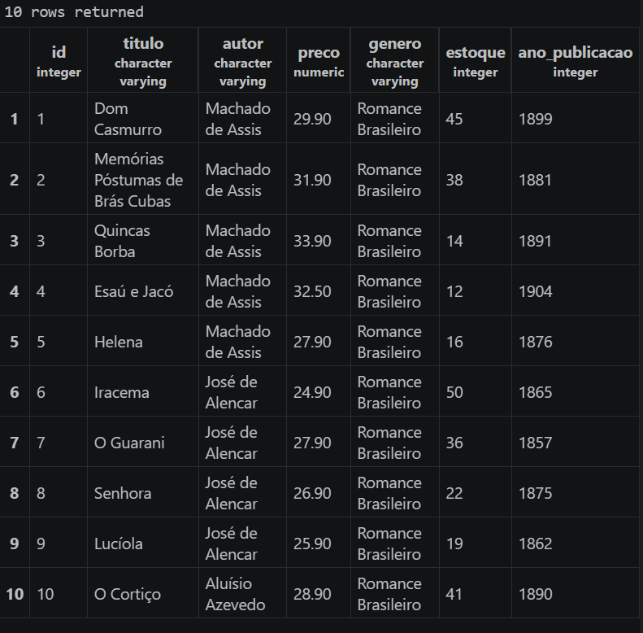

---

### 2. Exiba apenas as colunas titulo, autor e preço de todos os livros.

Usaremos o seguinte código:

```sql
SELECT titulo,autor,preco FROM livros;
```

Com isso, teremos o seguinte resultado:

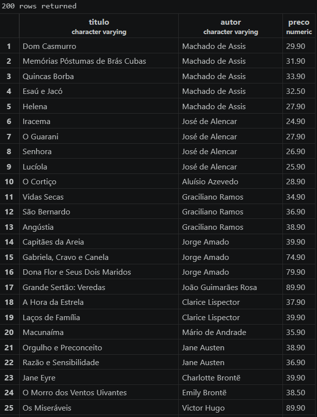
> OBS: Apenas 25 resultados couberam na print, mas como vemos na linha '200 rows returned' sabemos que todos os 200 livros apareceram.

---

### 3. Liste os gêneros distintos existentes na base, em ordem alfabética.

Usaremos o seguinte código:

```sql
SELECT DISTINCT genero FROM livros ORDER BY genero;
```

Com isso, teremos o seguinte resultado:

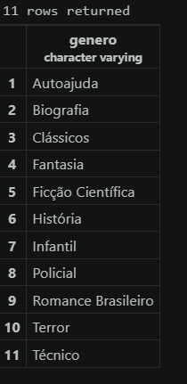

---

### 4. Descubra quantos livros existem no total, e depois quantos autores diferentes existem.

Para descobrirmos quantos livros existem no total, podemos usar o código:

```sql
SELECT DISTINCT titulo FROM livros;
```

Vamos apenas prestar atenção na primeira linha:

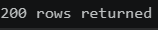

O texto `200 rows returned` indica que há 200 livros registrados na tabela.

--- 

Para sabermos quantos autores diferentes existem, usamos:

```sql
SELECT DISTINCT autor FROM livros;
```

Mais uma vez, vamos prestar atenção apenas na primeira linha:

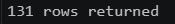

Isso indica que há 131 autores diferentes.

---

### 5. Liste os 5 livros mais caros da base (título e preço).

Para isso, usaremos o código:

```sql
SELECT titulo,preco FROM livros ORDER BY preco DESC LIMIT(5);
```

Isso retorna:

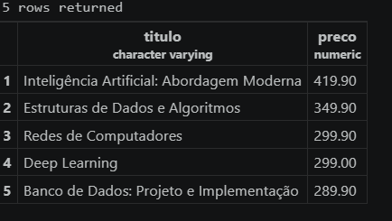

---

### 6. Liste os 5 livros com menor estoque (título e estoque).

Para isso, usaremos o código:

```sql
SELECT titulo,estoque FROM livros ORDER BY estoque LIMIT(5);
```

Isso retorna:

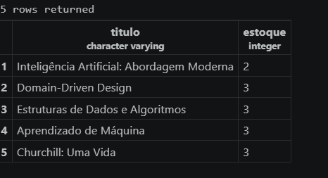

---

## 🗒️ Bloco 2

### 7. Mostre titulo e estoque de todos os livros do gênero Técnico.

Antes, vamos ver quais os gêneros registrados com o código:

```sql
SELECT DISTINCT genero FROM livros;
```
Isso retorna:

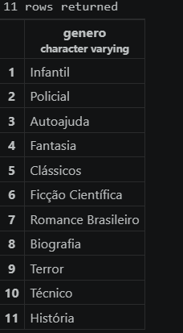

Vemos então que queremos os livros da categoria nomeadas como 'Técnico'.

```sql
SELECT titulo,estoque FROM livros WHERE genero = 'Técnico';
```

Isso retorna:

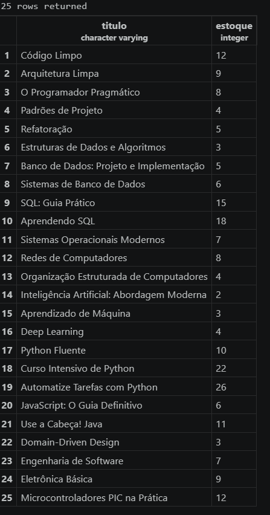

---

### 8. Mostre titulo e preco dos livros que custam mais de R$ 200,00.

Para isso usamos o código:

```sql
SELECT titulo,preco FROM livros WHERE preco > 200;
```

Isso retorna:

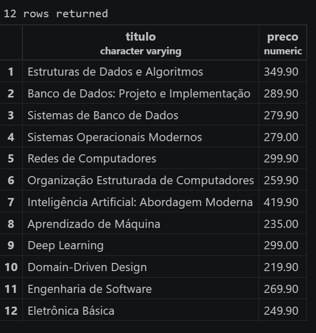

---

### 9. Mostre titulo e preco dos livros com preço entre R$ 40,00 e R$ 70,00.

Para isso usamos o código:

```sql
SELECT titulo,preco FROM livros WHERE preco BETWEEN 40 AND 70;
```
Isso retorna:

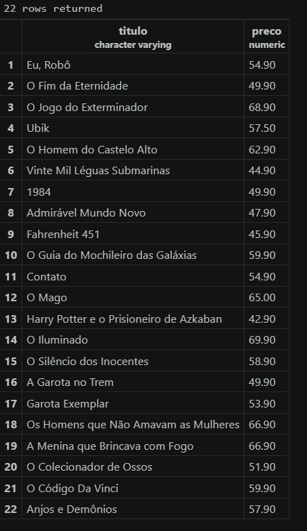

---

### 10. Mostre os livros com estoque abaixo de 5 unidades (situação de reposição urgente).

Usaremos o código:

```sql
SELECT titulo,estoque FROM livros WHERE estoque < 5;
```

Resultado:

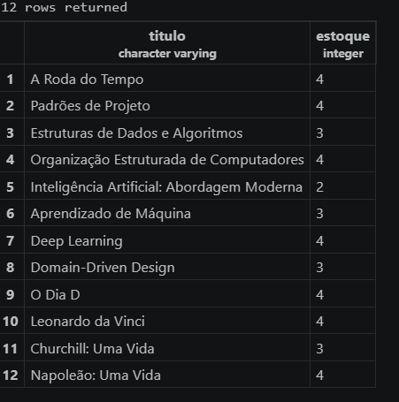

---

### 11. Liste os livros publicados antes de 1900, ordenados do mais antigo para o mais recente.

Código:

```sql
SELECT titulo,ano_publicacao FROM livros WHERE ano_publicacao < 1900 ORDER BY ano_publicacao;
```

Resultado:

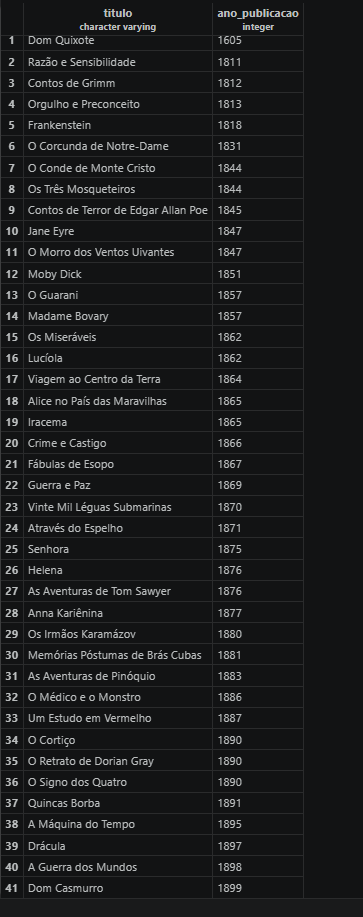

---

### 12. Liste os livros publicados entre 2010 e 2020, mostrando título, ano e gênero.

Código:

```sql
SELECT titulo,ano_publicacao,genero FROM livros WHERE ano_publicacao BETWEEN 2010 AND 2020;
```

Resultado:

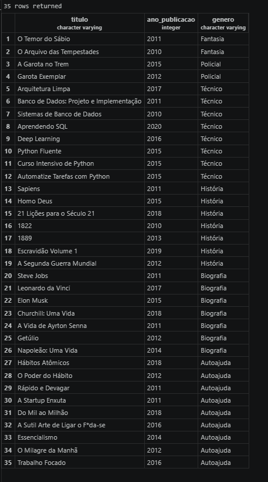