# Atividade Prática 05 — Análise de Dados

> Consultas SQL com PostgreSQL: da criação do banco até agregações e colunas calculadas.

Nessa atividade a ideia foi praticar consultas SQL usando o PostgreSQL, desde a criação do banco até consultas mais elaboradas com funções de agregação e colunas calculadas. Abaixo está tudo documentado passo a passo, com o código usado e os prints das saídas.

## Sumário

- [Criando o banco e a tabela](#criando-o-banco-e-a-tabela)
- [Parte A — Consultas e filtros](#parte-a--consultas-e-filtros)
- [Parte B — Funções de agregação](#parte-b--funções-de-agregação)
- [Parte C — Painel e cálculos](#parte-c--painel-e-cálculos)

---

## Criando o banco e a tabela

Primeiro, no Moba, criei o banco de dados no Postgres com:

```sql
CREATE DATABASE I1D35;
```

Depois criei a tabela `produtos`, que vai guardar as informações de cada item da loja:

```sql
CREATE TABLE produtos (
    id SERIAL PRIMARY KEY,
    nome VARCHAR(100) NOT NULL,
    categoria VARCHAR(50) NOT NULL,
    marca VARCHAR(50) NOT NULL,
    preco DECIMAL(10,2) NOT NULL,
    estoque INT NOT NULL,
    data_cadastro DATE NOT NULL
);
```

**Populando a tabela:** os itens fornecidos no arquivo `produtos.sql` foram inseridos usando o próprio script disponibilizado.

---

## Parte A — Consultas e filtros

Aqui o foco foi treinar `SELECT`, `WHERE` e `ORDER BY`.

### A1. Nome e preço dos produtos da categoria Monitores

```sql
SELECT nome, preco 
FROM produtos 
WHERE categoria = 'Monitores';
```

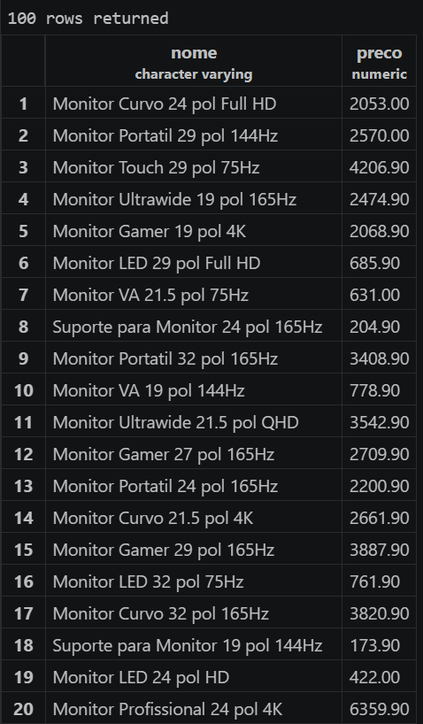

### A2. Produtos com estoque menor que 5 unidades

Mostrando nome, categoria e estoque:

```sql
SELECT nome, categoria, estoque 
FROM produtos 
WHERE estoque < 5;
```

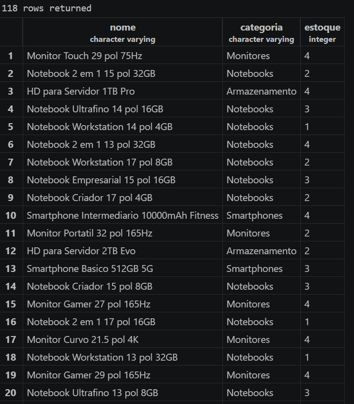

### A3. Os 10 produtos mais caros da loja

Nome e preço, do mais caro pro mais barato:

```sql
SELECT nome, preco 
FROM produtos 
ORDER BY preco DESC;
```

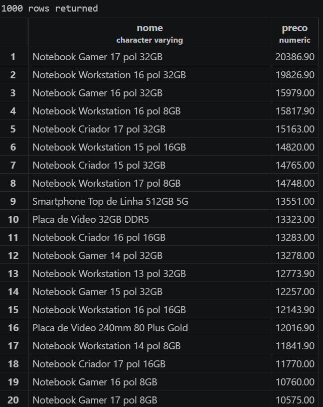

### A4. Produtos da marca Logitech, do mais barato pro mais caro

```sql
SELECT nome, preco 
FROM produtos 
WHERE marca = 'Logitech' 
ORDER BY preco;
```

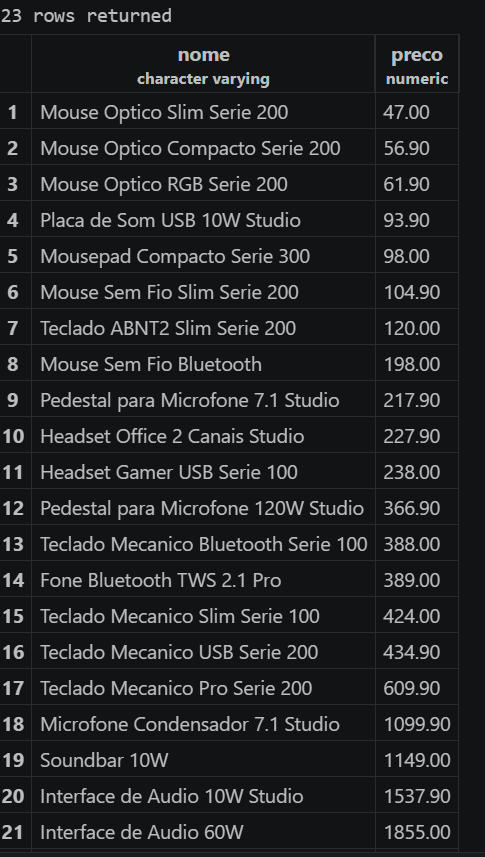

### A5. Produtos com preço entre R$ 100,00 e R$ 500,00

```sql
SELECT nome, preco 
FROM produtos 
WHERE preco BETWEEN 100 AND 500;
```

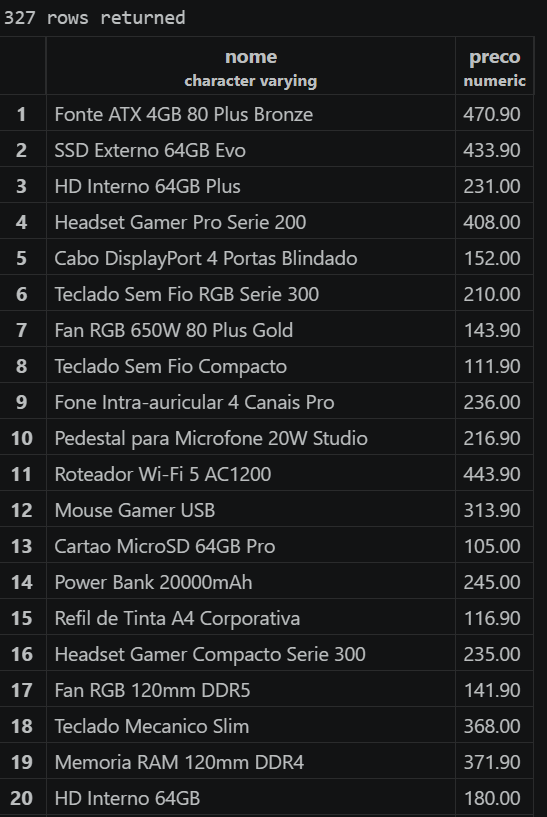

---

## Parte B — Funções de agregação

Nessa parte a ideia foi usar `COUNT`, `MAX`, `MIN`, `AVG` e `SUM` pra tirar números gerais sobre a loja.

### B1. Quantos produtos existem cadastrados na loja?

Resultado nomeado como `total_de_produtos`:

```sql
SELECT COUNT(*) AS total_de_produtos 
FROM produtos;
```

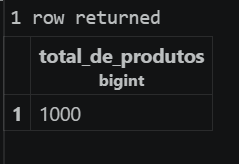

### B2. Quantos produtos estão com estoque abaixo de 10 unidades?

Coluna nomeada como `produtos_em_falta`:

```sql
SELECT COUNT(*) AS produtos_em_falta 
FROM produtos 
WHERE estoque < 10;
```

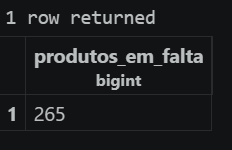

### B3. Maior e menor preço da loja

Trazendo os dois na mesma consulta, como `maior_preco` e `menor_preco`:

```sql
SELECT MAX(preco) AS maior_preco, MIN(preco) AS menor_preco 
FROM produtos;
```

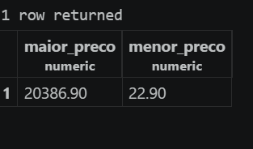

### B4. Preço médio dos produtos da categoria Notebooks

Arredondado para 2 casas decimais:

```sql
SELECT ROUND(AVG(preco), 2) AS media_notebooks 
FROM produtos 
WHERE categoria = 'Notebooks';
```

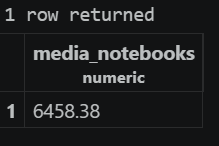

### B5. Total de peças em estoque

Somando o estoque de todos os produtos, como `total_de_pecas`:

```sql
SELECT SUM(estoque) AS total_de_pecas 
FROM produtos;
```

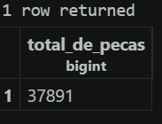

---

## Parte C — Painel e cálculos

Aqui juntei tudo que aprendi nas partes anteriores pra montar consultas mais completas, pensando em algo que faria sentido pra um gerente ver de fato.

### C1. Painel resumo em uma única consulta

Retornando de uma vez a quantidade de produtos, preço médio (2 casas decimais), maior preço, menor preço e total de peças em estoque, tudo com nomes de coluna fáceis de entender:

```sql
SELECT 
    COUNT(*) AS quantidade_de_produtos, 
    ROUND(AVG(preco), 2) AS preco_medio, 
    MAX(preco) AS maior_preco, 
    MIN(preco) AS menor_preco, 
    SUM(estoque) AS total_de_pecas_em_estoque 
FROM produtos;
```

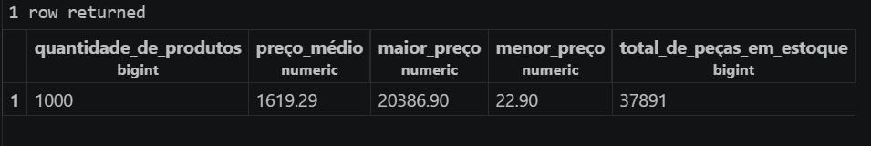

### C2. Valor imobilizado por produto

Como o valor imobilizado (preço × estoque) não vem pronto na tabela, precisei calcular essa coluna na hora. Abaixo, os 5 produtos com maior valor imobilizado, mostrando nome, preço, estoque e o valor calculado (`valor_em_estoque`):

```sql
SELECT 
    nome, 
    preco, 
    estoque, 
    (preco * estoque) AS valor_em_estoque 
FROM produtos 
ORDER BY (preco * estoque) DESC 
LIMIT 5;
```

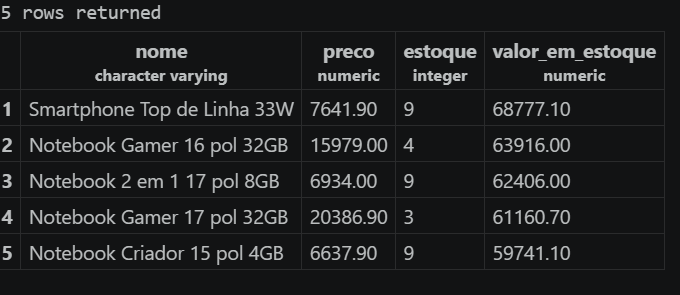

### C3. Comparando C2 com o produto mais caro de A3

Mesmo o produto mais caro isoladamente (visto na A3) tendo um preço unitário maior que o do smartphone que aparece no topo da C2, o estoque desse smartphone é bem maior, e como o valor imobilizado é o preço multiplicado pelo estoque, essa multiplicação acaba fazendo o smartphone superar o item mais caro em valor total parado na loja.