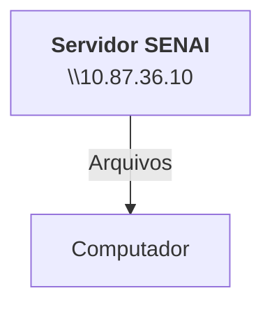
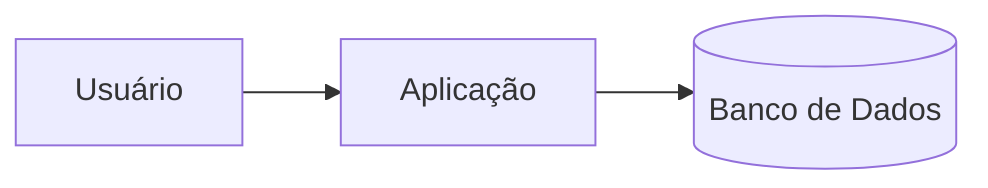
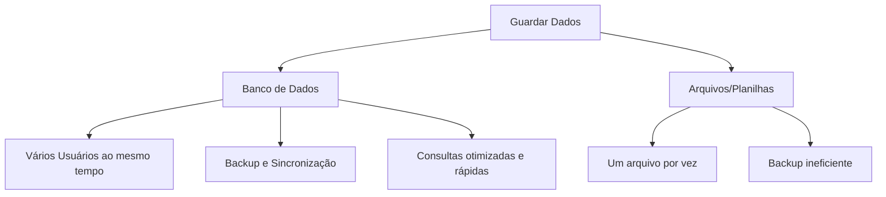

## Configuração do Servidor Educacional
O objetivo é simular um ambiente real de produção


---

**Objetivo**: 
- Experiência real de mercado;
- Administração de recursos;
- Experiência em servidores Linux;

## Servidor de Arquivos
Servidor educacional para arquivos, assim não dependendo da rede externa para downloads.



---

## Servidor de Desenvolvimento

Cada aluno recebe seu próprio acesso.
Cada máquina possui um endereço de IP único.

> 192.168.10.19

---

|Recurso|Configuração|
|-------|------------|
|CPU|2 Cores|
|RAM|512 MB|
|HD|6 GB|
|SO|Ubuntu 26.04 LTS|
|ACESSO| SSH (Secure Shell)|

---

**Dados de Acesso:**

|Campo|Valor|
|-----|-----|
|IP do Container|192.168.10.19|
|Usuário|Root|
|Senha Inicial|aluno01|

---

**Comando para visualizar o uso de recursos:**

```bash
htop
```

Comando para alterar a senha:

```bash
passwd
```

---

## Banco de Dados

> **Dados:** 
Isolados não dizem muita coisa. Ex: *Platini, Futebol, Chuteira.*

> **Informação:** 
Dados estruturados. Ex: *O Platini comprou uma chuteira para jogar futebol.*

> **Conhecimento:** 
O que podemos extrair à partir das informações. Ex: *O Platini vai jogar futebol com a I1D35*


---

O fluxo normal de um banco de dados:


---

> Por qual razão as empresas não salvam os dados em arquivos comuns? Por exemplo, via Excel?



---

## SGBD
### Sistema Gerenciador de Banco de Dados

--- 

Exemplos de grandes SGBD's no mercado:

- PostgreSQL (Open Source)
- MySQL (Oracle)
- MsSQL (Microsoft)
- Oracle DB (Oracle)
- SQLite (Open Source)

**Utilizaremos o PostgreSQL**


Para a instalação do PostgreSQL, utilizar o comando:

```bash
sudo apt install -y postgresql
```