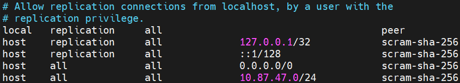

# 🐘 Guia Prático de Configuração e Gerenciamento do PostgreSQL

<div align="center">
  
</div>

<br />

## 📊 Status e Acesso ao Banco de Dados

Para verificar o status e os detalhes dos clusters do PostgreSQL em execução:

```bash
pg_lsclusters
```

### Acesso via Socket Local (sem senha)

Para acessar o terminal interativo do PostgreSQL (`psql`) como superusuário do sistema:

```bash
sudo -u postgres psql
```

> 💡 **Dica:** Para sair do terminal interativo do PostgreSQL a qualquer momento, digite `\q` e pressione `Enter`.

---

## 🔑 Alteração de Senha

No terminal interativo (`psql`), execute a seguinte instrução SQL para redefinir a senha do usuário padrão:

```sql
ALTER USER postgres PASSWORD 'novasenha';
```

> ⚠️ **Observações de Sintaxe SQL:**
> * **Aspas simples:** O PostgreSQL aceita **apenas** aspas simples (`'`) para valores do tipo texto (*strings*).
> * **Ponto e vírgula:** Toda instrução SQL precisa ser finalizada com ponto e vírgula (`;`).

Se a alteração for realizada com sucesso, a mensagem de confirmação será exibida:

```text
ALTER ROLE
```

### Testando Conexão via TCP/IP

Após alterar a senha, valide o acesso conectando-se via endereço IP local:

```bash
sudo psql -h 127.0.0.1 -U postgres
```

---

## ⚙️ Configurações Iniciais e Acesso Remoto

Para permitir conexões externas de outros endereços IP, configure os dois arquivos descritos a seguir:

### 1. Habilitar Escuta de IPs (`postgresql.conf`)

1. **Navegue até o diretório do PostgreSQL:**
   ```bash
   cd /etc/postgresql/18/main/
   ```

2. **Abra o arquivo de configuração para edição:**
   ```bash
   sudo nano postgresql.conf
   ```

3. **Habilite a escuta para todas as redes:**
   Localize o parâmetro `listen_addresses` e ajuste para:
   ```ini
   listen_addresses = '*'
   ```
    > **OBS:** Lembre-se de "descomentar" a linha.

---

### 2. Autorizar Conexões na Rede (`pg_hba.conf`)

1. **Navegue até o diretório de configurações (caso não esteja nele):**
   ```bash
   cd /etc/postgresql/18/main/
   ```

2. **Abra o arquivo de regras de autenticação:**
   ```bash
   sudo nano pg_hba.conf
   ```

3. **Adicione as linhas ao final do arquivo:**
   ```
   host    all             all             0.0.0.0/0               scram-sha-256
   host    all             all             10.87.47.0/24           scram-sha-256
   ```

   > 📌 **Nota:** Utilize espaços ou a tecla `TAB` para alinhar as colunas e manter a organização do arquivo.

   **Exemplo de Configuração:**

   

> 💡 **Dica de uso do Nano:** Para salvar e sair do editor `nano`, pressione `CTRL + X`, confirme digitando `Y` (ou `S`, dependendo do idioma) e pressione `Enter`.

> ⌨️ **Comando para reiniciar o postgreSQL:** `sudo systemctl restart postgresql`

---

## 💾 Criando e Listando Bancos de Dados

Dentro do terminal interativo do PostgreSQL (`psql`):

1. **Listar bancos de dados existentes:**
   ```sql
   \l
   ```

2. **Criar um novo banco de dados:**
   ```sql
   CREATE DATABASE cidades;
   ```

Se o banco for criado com sucesso, o sistema exibirá:

```text
CREATE DATABASE
```

---

## 💻 Conexão ao Banco de Dados via VSCode

Para gerenciar o banco diretamente pelo VSCode, utilize a extensão [PostgreSQL](https://marketplace.visualstudio.com/items?itemName=ckolkman.vscode-postgres) por Chris Kolkman.

### Passo a Passo de Conexão:

1. Clique em **"Add Connection"** no painel da extensão.
2. Informe o IP do servidor (ex.: `192.168.10.19`).
3. Digite o nome de usuário (`postgres`).
4. Insira a senha definida anteriormente.
5. Mantenha ou informe a porta padrão (`5432`).
6. Selecione a opção **"Standard Connection"**.
7. Selecione o banco de dados que deseja conectar (ex.: `cidades`).
8. Confirme as informações pressionando `Enter`.

---

## 🛠️ Comandos Úteis para CLI Linux

| Comando | Descrição |
| :--- | :--- |
| `htop` | Gerenciador de tarefas e monitor interativo de recursos em tempo real no terminal. |