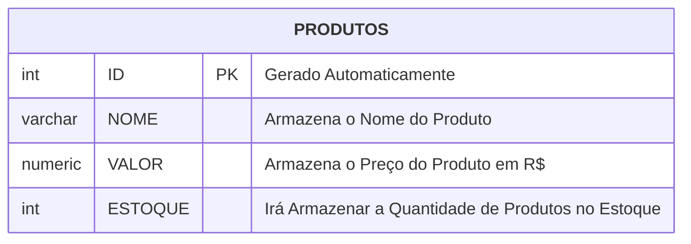
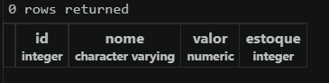
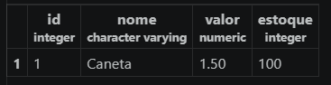

# 🗑️ **Excluindo Databases:**

Para excluir uma database, utilizamos o comando:
```postgresql
DROP DATABASE nome;
```

por exemplo, `DROP DATABASE cidades;`

Se a database for excluída com sucesso, a mensagem `DROP DATABASE` deve ser retornada.

---

## **Modelagem do Banco de Dados:**



Após modelar, iremos executar as etapas de criação e de inserção dos dados.

## **Criando a Tabela:**

Para criar uma tabela para registrar os dados dos produtos, utilizando a extensão previamente instalada, iremos clicar com o botão direito no banco de dados chamado "loja", depois em "New Query". 

Isso abrirá um arquivo de query. Nesse arquivo, utlizamos o seguinte código:

```postgresql
CREATE TABLE produtos(
    id INT GENERATED ALWAYS AS IDENTITY PRIMARY KEY,
    nome VARCHAR(100) NOT NULL,
    valor NUMERIC(10, 2) NOT NULL,
    estoque INT NOT NULL DEFAULT 0
);
```

Então pressionar `F5`. Isso deve mostrar a mensagem "`null rows created`".

### **Visualizando a Tabela:**
Agora, para consultarmos todos os elementos da tabela, utilizaremos o seguinte código no arquivo de query:

```postgresql
SELECT * FROM produtos;
```

No momento a tabela está vazia, então o resultado deve se parecer com isso:



### **Adicionando Itens na Tabela:**

Agora vamos adicionar nosso primeiro produto: Uma caneta. No arquivo de query, o seguinte código:

```postgresql
INSERT INTO produtos(nome,valor,estoque)
VALUES
('Caneta', '1.50', '100');
```

Isso deve retornar "`1 row inserted`".

Checando novamente a tabela, agora temos o seguinte resultado:

